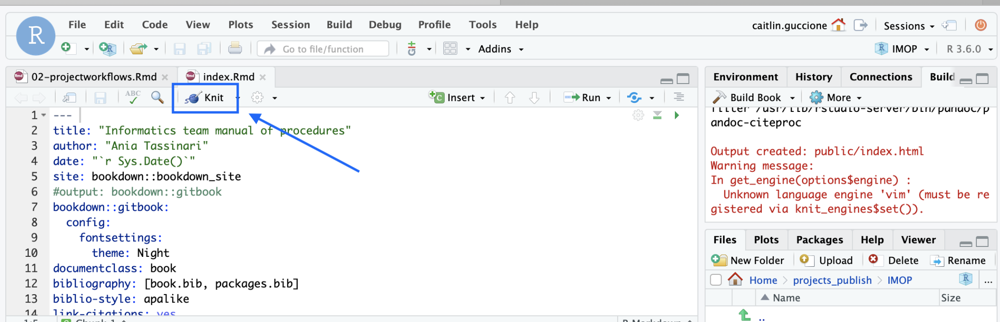
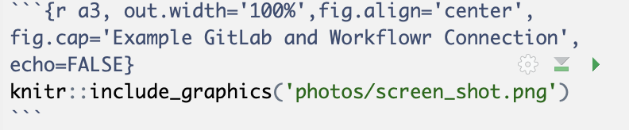

<!-- This creates wrapping for every code chunck in this file --> 


#  Project Workflows  {#workflows}

<!-- Start of Caitlin Guccione Workflowr - Summer 2019 -->

<!--html_preserve--><script>
  addClassKlippyTo("pre.r, pre.markdown");
  addKlippy('left', 'top', 'auto', '1', 'Copy code', 'Copied!');
</script><!--/html_preserve-->

## Using Workflowr

### Quick Start

This is a quick version of everything listed below, if you want more clear or specific instructions then please skip this section.  

#### Set Up

In the `Console` tab of RStudio in `(None)` project: 


```r
install.packages("workflowr")
library("workflowr")
wflow_git_config(user.name = "First Last", 
    user.email = "first.last@agios.com")
```

[Click here for more specfic details on **set up**][Installation]

#### Creating Projects

In the `Console` tab, 


```r
wflow_start("PROJECT_NAME")
wflow_build()
wflow_publish(c("analysis/*.Rmd"), 
    "Publish the initial files for PROJECT_NAME")
```

[Click here for more specfic details on **creating projects**][Create Project]

#### Connecting to GitLab

In the `Console` tab, 


```r
wflow_use_gitlab(username = "first.last", 
    repository = "PROJECT_NAME", 
    domain = "ceres.agios.com")
```

Go to GitLab and do the following:

+ Create a project in GitLab with the same name as the project in RStudio
    + We called our project:  PROJECT_NAME
+ Scroll down to the push an existing Git repository option
    + Copy everything in the box besides the cd line
+ Paste what you just copied into the `Terminal` tab in RStudio
    + Make sure you are in  PROJECT_NAME directory 

[Click here for more specfic details on **GitLab**][Connecting to GitLab]

#### Creating a New File

In the `Console` tab, 


```r
wflow_open("analysis/NEW_FILE.Rmd")
wflow_build()
wflow_publish(c("analysis/*.Rmd"), 
    "Publish the file NEW_FILE")
```

In the `Terminal` tab, 

```r
git push
```

[Click here for more specfic details on **creating new files**][Adding New Files]


#### Quick Useful Additions

##### Update Session Information Function

Add the following line to your `_workflowr.yml` file :

```
sessioninfo: "devtools::session_info()"
```

##### Publish to GitLab without Rebuilding Sites

The following is a quicker way to push to git without rebuilding your website.  

1. Edit the Rmd file and save
2. Run one of the following commands (doesn't matter)
    + `wflow_build()`
        + It doesn't matter if we build other files, they won't be added to git unless we add them in the next step
    + `wflow_build("file.rmd")`
    + Knit the file
3. `wflow_git_commit("file.rmd", "This is your commit message")`
4. Flip into the terminal and run `git push()`

[Click here for more specfic details][Quick Additions to Improve your Workflowr]

******

### Installation

#### Programs Needed 
We are assuming that you already have RStuido and GitLab, for this implementation we are using the RStudio on the new server (hpc.agios.local)  which is version 1.2.1335.1. 

If you don't have GitLab you need to have an account set up through Agios. If you don't have the updated RStudio you need to get access to the new server and then use the following link : [hpc.agios.local](https://hpc.agios.local) 

#### Installing Workflowr

1. Open RStudio and change project in the top right corner to `(None)`
    + Make sure you are in your home directory on RStudio as well, thus in the bottom right corner of your screen under `New Folder`, it is labeled `Home` with a small house. 

2. In the `Console` tab located in the bottom left hand corner : 


```r
install.packages("workflowr")
```

3. Confirm you have access to Workflowr, in the `Console` tab:


```r
library("workflowr")
```

#### Configure Git 
*This only needs to be done once per laptop

In the `Console` tab:


```r
wflow_git_config(user.name = "First Last", 
    user.email = "first.last@agios.com")
```


### Create Project 

#### Start Project

In the `Console` tab:


```r
wflow_start("PROJECT_NAME")
```
1. What does `wflow_start` do?
    + Creates a directory that contains all starting files
    + Changes your current directory to PROJECT_NAME 
    + Starts a Git repo which we will connect to GitLab repository 

2. What is the `analysis` folder for?
    + Contains all source R Markdown files (Rmd)
        + Includes: `index.rmd`
            + Contains no R code but generates `index.html` which eventually runs the entire project
    + Contains `_site.yml`
        + Allows user to edit theme, navigation bar, menus ect. 
        + Helpful [link]( https://bookdown.org/yihui/rmarkdown/rmarkdown-site.html) to customizing

    
3. What is the `docs` folder for?
    + Contains all HTML files for website 
        + Note that this file will be empty until we build the project 
        + Each HTML file is built from a corresponding Rmd file in the analysis folder
    + Contains any figures created by Rmd files


4. What about the data, code and output files?
    + These files are there for your use and thus can be deleted if desired

#### Build Project

In the `Console` tab:


```r
wflow_build()
```
1. What does `wflow_build()` do? 
    + Builds all the R Markdown files in analysis and saves their HTML in docs
    + Displays the website
    
Your website should like similar to the image of mine shown below (except with a Publish tab instead of a Dates tab) 


#### View Project

At any time you can view the current site on your local machine by typing in the `Console` tab:


```r
wflow_view()
```

#### Publish Website 

Currently, our project is simply an HTML file stored on our laptop, publishing the website will make it available online.

In the `Console` tab:


```r
wflow_status()
```

This allows you to view which files are published or unpublished currently.

Now we want to publish our page the command to do so takes three parts

1. c - Commit
2. ("analysis/index.Rmd", "analysis/about.Rmd", "analysis/license.Rmd"), - A character vector of the Rmd files you want published
    + It may be easier to place ("*.Rmd") here to use all the files
3. "Publish the initial files" -  A commit message to be posted 

Overall, `wflow_publish` is a quick and error-free way for us to commit and push all of our Rmd files to GitLab at once. 

In the `Console` tab:


```r
wflow_publish(c("analysis/index.Rmd", 
    "analysis/about.Rmd", "analysis/license.Rmd"), 
    "Publish the initial files for PROJECT_NAME")
```

### Connecting to GitLab

#### Creating a remote repository on GitLab

1. Log in to GitLab and click `New Project`
2. The project name in GitLab should the same name as the project in RStudio: PROJECT_NAME
3. Make sure to save it as Internal so everyone at Agios can see it 

#### Not working? Do you have an ssh key? **

In order for you to successfully connect to GitLab, you need to have an ssh key linked to your GitLab. 

There is a simple guide to doing this on GitLab [here](http://ceres.agios.com/help/ssh/README#generating-a-new-ssh-key-pair) so you can simply follow along below and click the link if you get lost.

1. Automatically copy your public key to the clipboard using one of the following commands:


```bash
# macOS:
pbcopy < ~/.ssh/id_ed25519.pub
# WSL / GNU/Linux (requires the xclip package):
xclip -sel clip < ~/.ssh/id_ed25519.pub
#Git Bash on Windows:
cat ~/.ssh/id_ed25519.pub | clip
```

2. Go back into your GitLab account and click on `Settings` then `SSH Keys` and simply paste and name your key there. 


** Only need to do this once per laptop or GitLab account 

#### Connect RStudio and GitLab

1. Go to RStudio, in `Console` tab:


```r
wflow_use_gitlab(username = "first.last", 
    repository = "PROJECT_NAME", 
    domain = "ceres.agios.com")
```

2. Go back to GitLab and scroll down to the `push an existing Git repository` option
    + Copy everything in the box on GitLab besides the first line which `cd` into the repo for the user, there is an example below of what this should look like. 


```r
git remote rename origin old-origin
git remote add origin git@ceres.agios.com:Caitlin.Guccione/test-.git
git push -u origin --all
git push -u origin --tags
```
    
3. Go back into RStudio and in the `Terminal` tab
    + Make sure you are in the PROJECT_NAME repo
    + Paste the above commands we got from GitLab

4. Return to GitLab to ensure your entire project exists there


<div class="figure" style="text-align: center">

<p class="caption">(\#fig:a3)Example GitLab and Workflowr Connection</p>
</div>

### Adding New Files

#### Creating New Files

Make sure you are inside the PROJECT_NAME project inside RStudio

In `Console` tab type:


```r
wflow_open("analysis/NEW_FILE.Rmd")
```

+ This command creates a new Rmd file and then opens it for your convenience. 

If we now want to see the HTML version of our file then we have two options:

1. In `Console` tab type:


```r
wflow_build()
```
+ You can add specific files to this command or simply leave it empty
+ This produces a small view of your website right on RStudio
    
2. Press the `Knit' button in RStudio as shown below: 



+ This produces a large web version of your current HTML file 

These steps will simply change the HTML file local bu tin order to make this public and add it to GitLab we need to update our changes. 

#### Update your Changes

1. Check the status to see what needs to be updated, in the `Console` tab,


```r
wflow_status()
```

This can also be done by looking at the red checks on the workflowr section of your live page as shown below: 


2. Make the appropriate HTML files public and updated, in the `Console` tab,


```r
wflow_publish(c("analysis/index.Rmd", 
    "analysis/NEW_FILE.Rmd"), "Add my first file")
```
+ This is the same format found on the `Publish Website` tab of this page and so you can customize it in the same way 


There is one exception to this and it's when you want to make updates to the `_site.yml` file found in the `analysis` folder. This file controls the style on the top of every page of your website. In this case, you want to update all HTML files even though their Rmd files aren't changed. 

In that case, use this,


```r
wflow_publish("analysis/_site.yml", 
    "Change the theme", republish = TRUE)
```

3. Push the final changes to GitLab

As we did previously in the `Publish Website`, in the `Terminal` tab,


```r
git push
```

#### Adding Workflowr to New File

If you want the normal workflowr setup which is found on all the other pages, then replace the --- part of the file with the following code:

```
            ---
            title: "Home"
            site: workflowr::wflow_site
            output:
              workflowr::wflow_html:
                toc: false
            editor_options:
              chunk_output_type: console
            ---
```


### Quick Additions to Improve your Workflowr

#### Update Session Information Function

The following steps simply add more information to your `Session Info` button found at the bottom of your workflowr. For more information about how to further custumize the Session Info output click [here](https://jdblischak.github.io/workflowr/articles/wflow-02-customization.html)

Add the following line to your `_workflowr.yml` file :

```
sessioninfo: "devtools::session_info()"
```

#### Publish to GitLab without Rebuilding Sites

The following is a quicker way to push to git without rebuilding your website. 

1. Edit the Rmd file and save
2. Run one of the following commands (doesn't matter)
    + `wflow_build()`
        + It doesn't matter if we build other files, they won't be added to git unless we add them in the next step
    + `wflow_build("file.rmd")`
    + Knit the file
3. `wflow_git_commit("file.rmd", "This is your commit message")`
4. Flip into the terminal and run `git push()`


### Create a LIVE Shareable Webpage 

Below are a few ways to share your project with others. These are used mainly if your project is in the Bookdown format or using 

#### A Simple Trick

This is the simplest way to share your workflowr page at the moment. In the future, we are hoping to have a cleaner way to do so.  

1. Have the new user clone your page on GitLab
2. Open the `docs` folder
3. Click on the `index.html` file

#### GitLab Pages

[GitLab Pages](https://about.gitlab.com/product/pages/) isn't currently available on Agio's GitLab. As soon as it is, we will add updates on how to simply set-up and share GitLab pages. If you would like to experiment with GitHub pages you may do so on your personal account, once GitLab pages are up and running they should behave in almost the same way. 

#### Beaker Browser

[Beaker Browser](https://beakerbrowser.com/) is a simple way to deploy a webpage from your computer without a server. We attempted to use Beaker Browser though we found it had a few setbacks and that other methods may be simpler. If you want to try it out for yourself, the link above is very straightforward.

Comparison list between GitLab pages and Beaker Browser: 

GitLab Pages| Beaker Browser 
:--- | :---
Slightly complex setup   | Simpler setup
Automatically updates changes, since it's already linked to Git | Not a clear path to Git and thus must manually update
Well documented | Little documentation 
Easy to share internally through GitLab | Have to download Beaker in order to view the webpage 

### Styling the Webpage 

#### Helpful Links

If you already have an idea of what you would like to change, below are a few very helpful resources filled with information:

+ This resource is a great place to start because it has all basics of Rmd syntax and I used it as a cheat sheet along the way.
    + [Rmd Cheat Sheet](https://rmarkdown.rstudio.com/authoring_basics.html)

+ This is an entire book all about Rmd and how to use it. I found it rather lengthy but very helpful.
    + [Rmd Thorough Guide](https://bookdown.org/yihui/rmarkdown/html-document.html#appearance_and_style)
    
+ If something isn't quite working right you may have run into a workflowr issue in which cause their FAQ's page is helpful.
    + [Workflowr FAQ's](https://jdblischak.github.io/workflowr/articles/wflow-05-faq.html)
    
#### Changing the Theme

Changing the theme modifies the overall appearance of the webpage is a quick and easy way to spice up the page.

1. Go into your `analysis/_site.yml` file
2. Underneath `ouput` add `theme = cerulean` as shown below:
    + The cerulean theme matches Agios colors 

```r
output:theme:cerulean
```
3. Choose your theme
    + The following themes are available : “default”, “cerulean”, “journal”, “flatly”, “darkly”, “readable”, “spacelab”, “united”, “cosmo”, “lumen”, “paper”, “sandstone”, “simplex”, “yeti”
    + You can view how they look here: [Themes](https://bootswatch.com/)
    
4. Preview your theme using,


```r
wflow_build()
```

5. Update your website by running,
    + This will rebuild every HTML file even if their corresponding Rmd file hasn't been updated 


```r
wflow_publish("analysis/_site.yml", 
    "Change the theme", republish = TRUE)
```

The following website will also walk you through changing the theme: [Themes Overview](https://jdblischak.github.io/workflowr/articles/wflow-02-customization.html#changing-the-theme)

#### Adding Photos

Although this may seem like a simple task, it is a bit challenging since we are using Workflowr

1. Create a `photos` folder inside the `docs` folder and add your photo there:


```r
dir.create("docs/photos")
```

2. Include the following command wherever you want your graphic to appear:



3. View the images on the webpage


```r
wflow_build()
```

4. Add to GitLab
    + We need to push the actual photo to GitLab using `wflow_git_commit` and then we can use `wflow_publish` to automatically push the rest of the files to GitLab 


```r
wflow_git_commit("docs/assets/external.png", 
    "Add external image of ...")
wflow_publish()
```

#### Blogdown

[Blogdown](https://bookdown.org/yihui/blogdown/a-quick-example.html) is another way that you can customize your workflowr page more easily. It is a combination of the well known blogdown and workflowr.

You can clone the following repo on GitHub if you want to try it out: [Blogdown/Workflowr Repo](https://github.com/docmanny/workflowr-blogdown-experiment)

*****

<!-- End of Caitlin Workflowr-->

## Set Up Workflow and Executing 

### Create a folder for your *newproject*
Come up with a project structure you like and stick with it.

#### Copy from a previously created template folder

Use `cp -r project_template newproject`, where `project_template` has structure:


#### Use a `bash` script

Call `./setup_project.sh newproject`, where `setup_project.sh` is:

<pre><code>#!/bin/bash

NEW=$1

## Set up folder structure
mkdir $NEW
cd $NEW

touch README

mkdir data
mkdir data/raw
mkdir data/raw/pheno
mkdir data/interim
mkdir data/processed
mkdir data/processed/pheno
touch data/raw/MAKE_EVERY_FILE_READ_ONLY

mkdir results
mkdir results/reports
mkdir results/notebooks
mkdir results/figures

mkdir sub
mkdir sub/logs
mkdir sub/qsub

mkdir src
touch src/functions.R
</code></pre>

<div class="alert alert-info">
  <strong>Don't forget!</strong> <br>
  - Fill project README <br>
  - Adapt structure to project needs <br>
  - Exclude data and other large files from git using `.gitignore` (see next section)<br>
  - Make files in `data/raw` read-only with `chmod -w`
</div>

<div class="alert alert-warning">
  <strong>Project organization ideas:</strong> <br>
http://projecttemplate.net/getting_started.html <br>
<a href=https://peerj.com/preprints/3192.pdf>Packaging data analytical work reproducibly using R (and friends)</a><br>
<a href=https://community.rstudio.com/clicks/track?url=https%3A%2F%2Fmaraaverick.rbind.io%2F2017%2F09%2Fr-workflow-fun%2F&post_id=8980&topic_id=1995>R workflow fun</a><br>
<a href=https://drivendata.github.io/cookiecutter-data-science/>Cookiecutter Data Science</a><br>
</div>

### Set up a repository for your code on Agios' secure GitLab
Create a new project at <a href>http://ceres.agios.com</a> (Mark P. can help)

### Set up a repository for your code locally and link to GitLab
In your *newproject* folder on command line execute (modify user name):


<!-- <pre><code>git init -->

```r
git add .
git commit -am 'initial commit'
git remote add origin git@ceres.agios.com:User.Name/newproject.git
git push -u origin master 
```
<!-- </code></pre> -->

### Set up an R project in RStudio
Choose Existing Directory (*newproject*) <br>


### Analysis in R and RStudio


**Data:**

  * Raw data:
    + If accessed from the web, include url, description, and date accessed in README
  
  * Processed:
    + Processed data should be named so it is easy to see which script generated the data
      + Can add file descriptions to  `filename.README` and place processing script in the same directory as data (works well for preprocessing steps, like alignments, etc)
    + Processed data should be <a href=http://vita.had.co.nz/papers/tidy-data.pdf>tidy</a>

**Code:**

  * Place (almost) all intermediate scripts in `newproject/src/`
  * Any chunks of code frequently reused in the analysis should be converted into functions, saved in `newproject/src/functions.R`, and sourced in scripts, notebooks and reports.  
  * Use <a href=https://google.github.io/styleguide/Rguide.xml>Google's R Style Guide</a> or <a href=http://style.tidyverse.org>The tidyverse styleguide</a> to format your code and make it easier to read (if need be run code through <a href=https://yihui.name/formatr/>formatR</a>)
  
**Figures:**

  * Exploratory:
    + Don't have to be pretty
    + Can be embedded in report / notebook
  
  * Final:
    + Should be polished and saved in `newproject/results/figures/`
    
**Scripts:**

  * Raw:
    + May be less commented (but comments help you!)
    + May be multiple versions
    + May include analyses that are later discarded
  
  * Final:
    + Clearly commented
    + Small comments liberally - what, when, why, how
    + Bigger commented blocks for whole sections
    + Include processing details
    + Only analyses that appear in the final write-up
    
**Notebooks and reports:**

  * R markdown files can be used to generate reproducible reports

  * Text and R code are integrated

  * Notebooks:
    + intermediate
    + may use one per day or one per subanalysis
    + documents all atempts
    
  * Reports:
    + final methods and results only
    + good for sharing
  

Adapted from: <a href=https://d18ky98rnyall9.cloudfront.net/_675d65293ef671c7dc754b3bd2779da6_Checklist.pdf?Expires=1525392000&Signature=XC-8TNzRrnwFEL5l6xadO9zD1jJxsLjfTwGovr1F6W~lWqZt0B2irE7zHKdQ2kJuQIF650WNaCPJzvnW83E-OaUDaCk4xIhhjdBVwMrJlgDGd3J8sOX2KlL8XRiZTdw3wbXa-C4JZ1r9tpuURHsZyleHTlorJ0ZGWN4VhuBtPd8_&Key-Pair-Id=APKAJLTNE6QMUY6HBC5A>Reproducible Research at Coursera</a> 


### Version control in git and GitLab
Adopt a branching workflow appropriate for the project and team size, and stick to it.

[gitforsmallteams](gitforsmallteams)

<div class="alert alert-info">
Reprinted from: <a href=http://www.joslynesser.com/blog/archives/2010/09/06/git-workflow-for-small-teams/>Git workflow for small teams</a>. Link currently is password protected.
</div>

<div class="alert alert-warning">
**`git` and `git-workflow` resources:**<br>
<a href=https://try.github.io/levels/1/challenges/1>Learn git</a> <br>
<a href=http://nvie.com/posts/a-successful-git-branching-model/>Git branching model</a> <br>
<a href=https://datasift.github.io/gitflow/IntroducingGitFlow.html>GitFlow</a>
</div>

### Keeping track of enviroment
Use `devtools::session_info()` 

<pre><code>> devtools::session_info()
Session info -----------------------------------------------------------------------------------------------------------------
 setting  value                       
 version  R version 3.4.2 (2017-09-28)
 system   x86_64, linux-gnu           
 ui       RStudio (99.9.9)            
 language (EN)                        
 collate  en_US.UTF-8                 
 tz       America/New_York            
 date     2018-05-02                  

Packages ---------------------------------------------------------------------------------------------------------------------
 package   * version date       source        
 backports   1.1.1   2017-09-25 CRAN (R 3.4.2)
 base      * 3.4.2   2017-10-05 local         
 compiler    3.4.2   2017-10-05 local 
 [...]
</code></pre>


or `sessionInfo()`

<pre><code>> sessionInfo()
R version 3.4.2 (2017-09-28)
Platform: x86_64-pc-linux-gnu (64-bit)
Running under: Ubuntu precise (12.04.4 LTS)

Matrix products: default
BLAS: /data2/software/R/3.4.2/lib/R/lib/libRblas.so
LAPACK: /data2/software/R/3.4.2/lib/R/lib/libRlapack.so

locale:
 [1] LC_CTYPE=en_US.UTF-8       LC_NUMERIC=C               LC_TIME=en_US.UTF-8        LC_COLLATE=en_US.UTF-8     LC_MONETARY=en_US.UTF-8    LC_MESSAGES=en_US.UTF-8    LC_PAPER=en_US.UTF-8       LC_NAME=C                 
 [9] LC_ADDRESS=C               LC_TELEPHONE=C             LC_MEASUREMENT=en_US.UTF-8 LC_IDENTIFICATION=C       

attached base packages:
[1] stats     graphics  grDevices utils     datasets  methods   base     

loaded via a namespace (and not attached):
 [1] Rcpp_0.12.13    digest_0.6.12   withr_2.0.0     rprojroot_1.2   backports_1.1.1 magrittr_1.5    evaluate_0.10.1 stringi_1.1.5   rstudioapi_0.7  rmarkdown_1.6   devtools_1.13.3 tools_3.4.2     stringr_1.2.0   yaml_2.1.14     compiler_3.4.2 
[16] memoise_1.1.0   htmltools_0.3.6 knitr_1.17   
</code></pre>

or `docker` with `rrtools`
